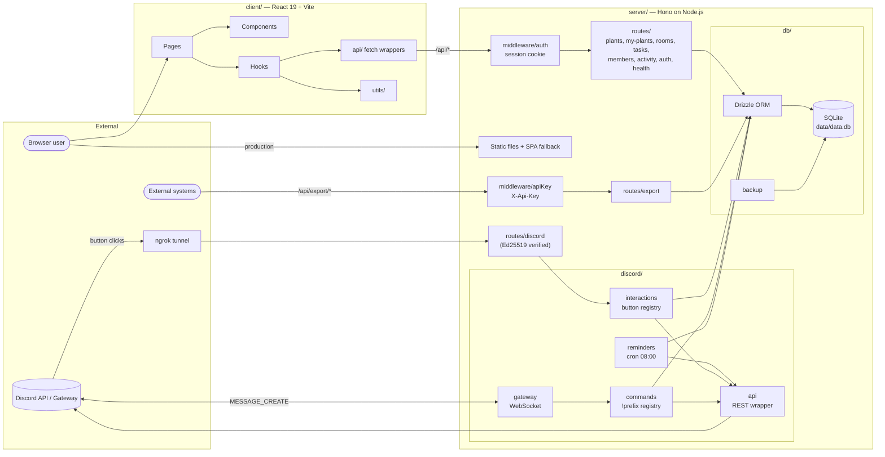
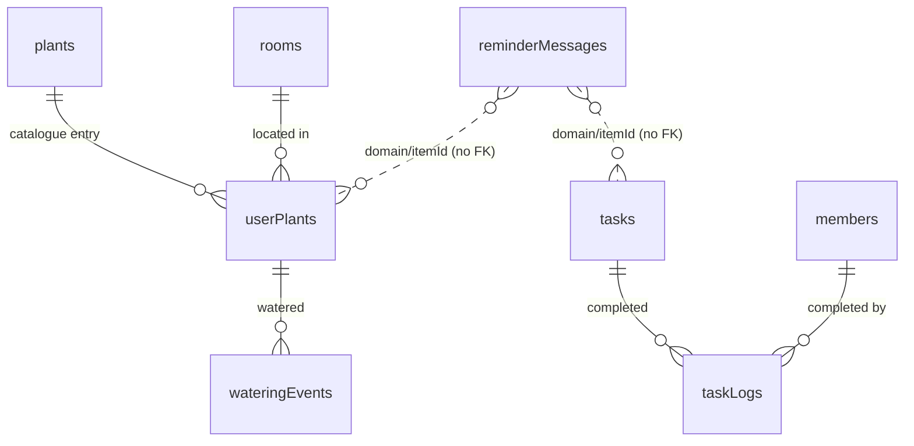

# Software Architecture

```mermaid
flowchart LR
    subgraph External
        User([Browser user])
        Discord[(Discord API / Gateway)]
        Ngrok[ngrok tunnel]
        Ext([External systems])
    end

    subgraph Client["client/ — React 19 + Vite"]
        Pages[Pages]
        Components[Components]
        Hooks[Hooks]
        ApiLayer[api/ fetch wrappers]
        Utils[utils/]
        Pages --> Components
        Pages --> Hooks
        Hooks --> ApiLayer
        Hooks --> Utils
    end

    subgraph Server["server/ — Hono on Node.js"]
        direction TB
        Static[Static files + SPA fallback]
        AuthMw[middleware/auth<br/>session cookie]
        KeyMw[middleware/apiKey<br/>X-Api-Key]
        Routes["routes/<br/>plants, my-plants, rooms, tasks,<br/>members, activity, auth, health"]
        ExportRoute[routes/export]
        DiscordRoute["routes/discord<br/>(Ed25519 verified)"]

        subgraph DiscordMod["discord/"]
            Interactions[interactions<br/>button registry]
            Commands[commands<br/>!prefix registry]
            Gateway[gateway<br/>WebSocket]
            Reminders[reminders<br/>cron 08:00]
            DApi[api<br/>REST wrapper]
        end

        subgraph DB["db/"]
            Drizzle[Drizzle ORM]
            SQLite[(SQLite<br/>data/data.db)]
            Backup[backup]
            Drizzle --> SQLite
            Backup --> SQLite
        end
    end

    User --> Pages
    ApiLayer -- "/api/*" --> AuthMw --> Routes
    User -- "production" --> Static
    Ext -- "/api/export/*" --> KeyMw --> ExportRoute
    Routes --> Drizzle
    ExportRoute --> Drizzle

    Discord -- "button clicks" --> Ngrok --> DiscordRoute --> Interactions
    Discord <-- "MESSAGE_CREATE" --> Gateway --> Commands
    Reminders --> DApi
    Interactions --> DApi
    Commands --> DApi
    DApi --> Discord
    Interactions --> Drizzle
    Commands --> Drizzle
    Reminders --> Drizzle
```

## Data model

```mermaid
erDiagram
    plants ||--o{ userPlants : "catalogue entry"
    rooms ||--o{ userPlants : "located in"
    userPlants ||--o{ wateringEvents : "watered"
    tasks ||--o{ taskLogs : "completed"
    members ||--o{ taskLogs : "completed by"
    reminderMessages }o..o{ userPlants : "domain/itemId (no FK)"
    reminderMessages }o..o{ tasks : "domain/itemId (no FK)"
```
