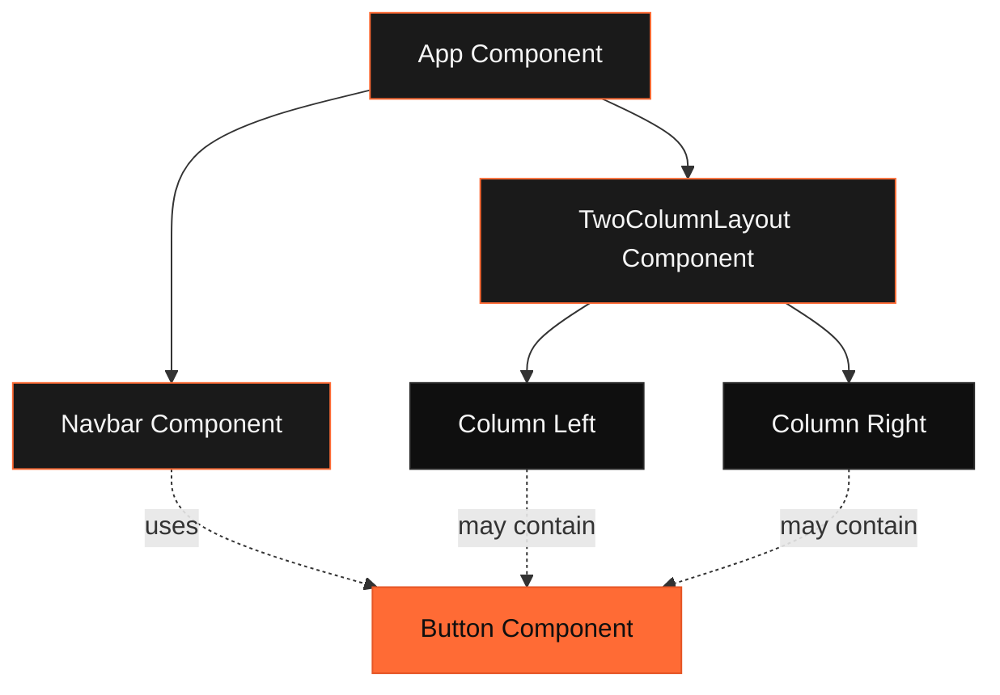

# Data Model: Dark Mode UI Layout Components

**Feature**: 001-dark-ui-layout  
**Date**: February 9, 2026  
**Purpose**: Define component architecture, props interfaces, and relationships

## Component Entities

### 1. Navbar Component

**Purpose**: Top navigation bar with links, responsive mobile menu, and orange accent hover states

**Properties**:
- `links`: Array of navigation link objects
  - `label`: string (display text)
  - `href`: string (navigation path)
  - `icon`: optional ReactNode (icon element)
- `logo`: optional ReactNode (brand logo)
- `mobileBreakpoint`: number (default: 768px)
- `className`: optional string (additional Tailwind classes)

**State**:
- `isMobileMenuOpen`: boolean (controls mobile menu visibility)

**Relationships**:
- Parent: `App` or layout wrapper component
- Children: `NavLink` components (internal)

**Validation Rules**:
- At least one link must be provided
- Each link must have non-empty `label` and `href`
- Href must start with `/` or `http://` or `https://`

**State Transitions**:
```
Mobile Menu States:
[Closed] ---> click hamburger ---> [Open]
[Open]   ---> click close/outside ---> [Closed]
[Open]   ---> click link ---> [Closed]
[Open]   ---> resize to desktop ---> [Closed]
```

---

### 2. TwoColumnLayout Component

**Purpose**: Main layout wrapper that organizes content into two responsive columns

**Properties**:
- `leftColumn`: ReactNode (content for left column)
- `rightColumn`: ReactNode (content for right column)
- `gap`: optional 'sm' | 'md' | 'lg' (default: 'md')
  - sm: 16px
  - md: 24px
  - lg: 32px
- `stackOnMobile`: optional boolean (default: true)
- `columnRatio`: optional '1:1' | '2:1' | '1:2' (default: '1:1')
- `className`: optional string

**State**: None (stateless presentational component)

**Relationships**:
- Parent: `App` or page component
- Children: Any React components passed as `leftColumn` and `rightColumn`

**Validation Rules**:
- Both `leftColumn` and `rightColumn` must be provided
- Gap must be one of predefined sizes
- ColumnRatio only applies on desktop viewports (≥768px)

**Responsive Behavior**:
```
Mobile (<768px):  Single column, stacked vertically
Tablet/Desktop (≥768px): Two columns, side-by-side per columnRatio
```

---

### 3. Column Component

**Purpose**: Individual column wrapper with consistent spacing and dark theme styling

**Properties**:
- `children`: ReactNode (column content)
- `spacing`: optional 'none' | 'sm' | 'md' | 'lg' (default: 'md')
- `backgroundColor`: optional 'bg' | 'surface' (default: 'surface')
- `border`: optional boolean (default: false)
- `className`: optional string

**State**: None (stateless presentationalcomponent)

**Relationships**:
- Parent: `TwoColumnLayout` or any container
- Children: Any React content

**Validation Rules**:
- Children must not be null or undefined
- Spacing and backgroundColor must be valid enum values

**Styling Matrix**:
```
backgroundColor: 'bg' --> #0f0f0f
backgroundColor: 'surface' --> #1a1a1a
border: true --> 1px solid #2a2a2a
```

---

### 4. Button Component (Utility)

**Purpose**: Reusable button with orange accent styling and hover states

**Properties**:
- `children`: ReactNode (button text/icon)
- `variant`: 'primary' | 'secondary' | 'ghost' (default: 'primary')
- `size`: 'sm' | 'md' | 'lg' (default: 'md')
- `onClick`: optional function
- `disabled`: optional boolean (default: false)
- `type`: optional 'button' | 'submit' | 'reset' (default: 'button')
- `className`: optional string

**State**: None (controlled by parent or form)

**Relationships**:
- Parent: Any component (Navbar, forms, etc.)
- Children: Text or icon elements

**Validation Rules**:
- Primary variant must use orange accent color
- Disabled state must have reduced opacity and prevent clicks
- All variants must meet WCAG AA contrast ratios

**Variant Styles**:
```
primary:   bg-orange-accent, hover:bg-orange-hover, text-dark-bg
secondary: border-orange-accent, text-orange-accent, hover:bg-orange-accent/10
ghost:     text-orange-accent, hover:bg-orange-accent/5
```

---

## Component Hierarchy

```
App
├── Navbar
│   ├── Logo
│   ├── NavLink (desktop, multiple)
│   └── MobileMenu
│       └── NavLink (mobile, multiple)
├── TwoColumnLayout
│   ├── Column (left)
│   │   └── [Page Content]
│   └── Column (right)
│       └── [Page Content]
└── Footer (future)
```

---

## Color Palette Entity

**Purpose**: Centralized color definitions for dark theme and orange accents

**Structure**:
```typescript
type ColorPalette = {
  dark: {
    bg: string;        // '#0f0f0f'
    surface: string;   // '#1a1a1a'
    border: string;    // '#2a2a2a'
  };
  orange: {
    accent: string;    // '#FF6B35'
    hover: string;     // '#FF8B5A'
    active: string;    // '#E55525'
  };
  text: {
    primary: string;   // '#f5f5f5'
    secondary: string; // '#a0a0a0'
    muted: string;     // '#6b6b6b'
  };
};
```

**Validation Rules**:
- All colors must be valid hex codes
- Contrast ratios must meet WCAG AA standards when combined
- Orange hue must be between 15-35 degrees in HSL

---

## Type Definitions

### Navigation Link

```typescript
interface NavLinkProps {
  label: string;
  href: string;
  icon?: React.ReactNode;
  isActive?: boolean;
}
```

### Layout Gap Sizes

```typescript
type GapSize = 'sm' | 'md' | 'lg';

const gapSizeMap: Record<GapSize, string> = {
  sm: 'gap-4',    // 16px
  md: 'gap-6',    // 24px
  lg: 'gap-8',    // 32px
};
```

### Column Ratios

```typescript
type ColumnRatio = '1:1' | '2:1' | '1:2';

const columnRatioMap: Record<ColumnRatio, string> = {
  '1:1': 'md:grid-cols-2',
  '2:1': 'md:grid-cols-[2fr_1fr]',
  '1:2': 'md:grid-cols-[1fr_2fr]',
};
```

---

## Relationships Diagram



---

## Data Flow

**Navbar State Management**:
```
User Click Hamburger
    → setIsMobileMenuOpen(true)
    → Menu renders with animation
    → Overlay captures outside clicks
    → setIsMobileMenuOpen(false) on: click outside, click link, ESC key
```

**Responsive Layout Adaptation**:
```
Window Resize Event
    → Check viewport width
    → If < 768px: Apply mobile classes (grid-cols-1, stack)
    → If ≥ 768px: Apply desktop classes (grid-cols-2, side-by-side)
    → Tailwind handles this automatically via responsive prefixes
```

---

## Edge Case Handling

### Navbar
- **Empty links array**: Render logo only, hide hamburger
- **Very long link labels**: Truncate with ellipsis on mobile
- **No logo provided**: Use text-based brand name fallback

### TwoColumnLayout
- **Significantly different content heights**: Use `items-start` alignment, not `items-stretch`
- **Empty column**: Render placeholder or hidden column
- **Three+ columns needed**: Not supported, use multiple TwoColumnLayout instances

### Column
- **Overflow content**: Apply `overflow-auto` for scrollable content
- **No children**: Render empty but maintain spacing

---

## Validation Summary

| Component | Required Props | Optional Props | Validation Rules |
|-----------|---------------|----------------|------------------|
| Navbar | links | logo, className | links.length >= 1, valid href format |
| TwoColumnLayout | leftColumn, rightColumn | gap, columnRatio, className | Both columns required, valid gap enum |
| Column | children | spacing, backgroundColor, border, className | Children not null, valid enum values |
| Button | children | variant, size, onClick, disabled, type, className | WCAG contrast, disabled prevents clicks |

---

## Next Steps

- Define TypeScript interfaces in `src/types/layout.ts`
- Create component prop contracts documentation
- Implement components following this architecture
- Write unit tests validating these relationships and rules
